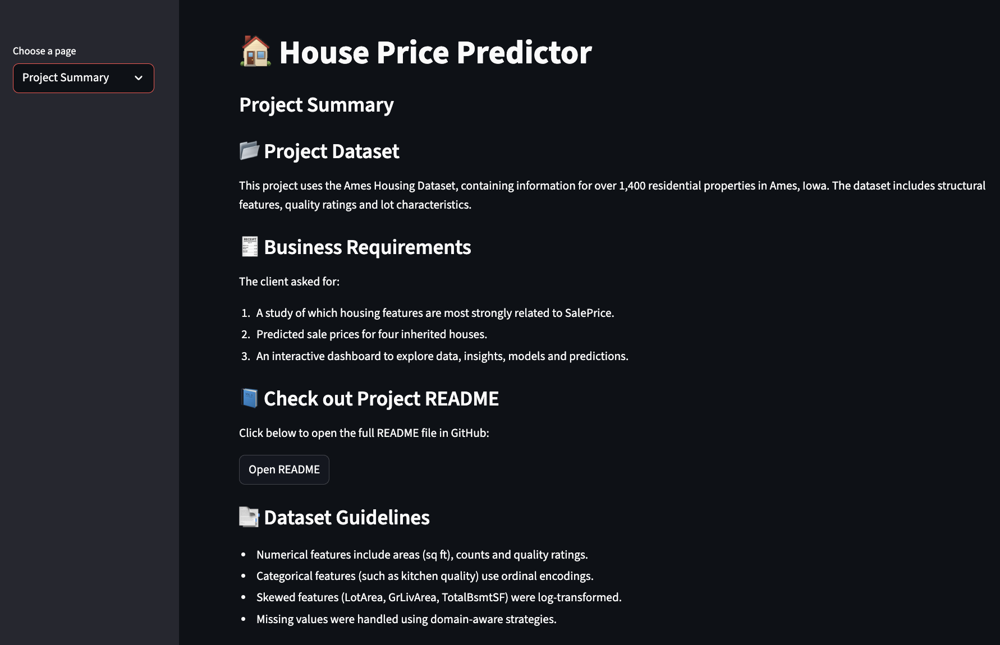
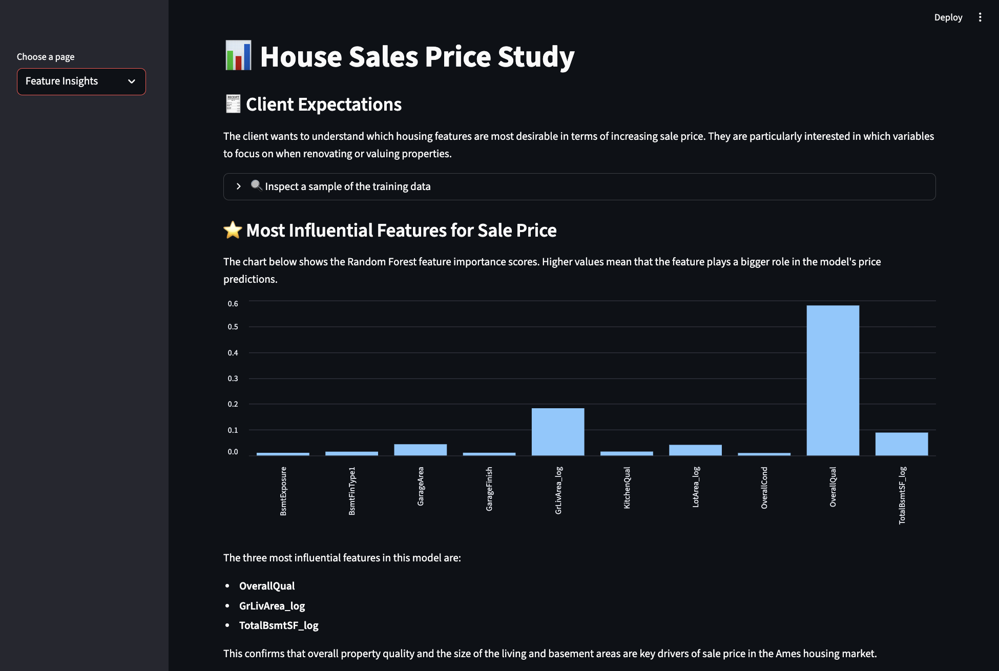
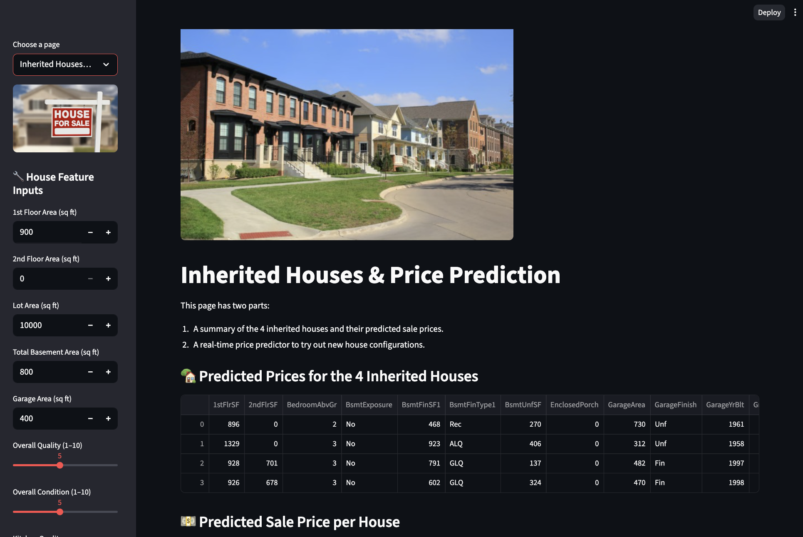
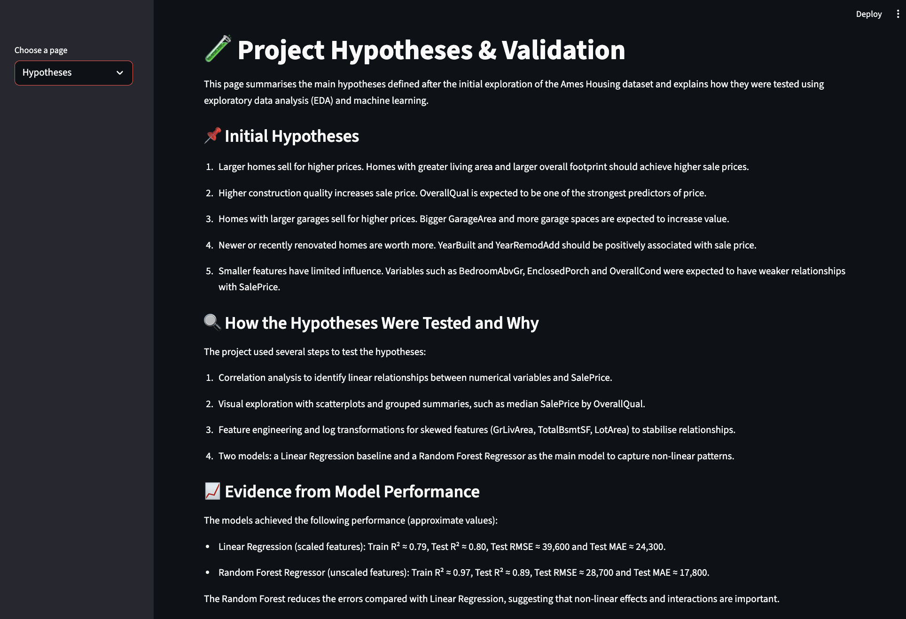
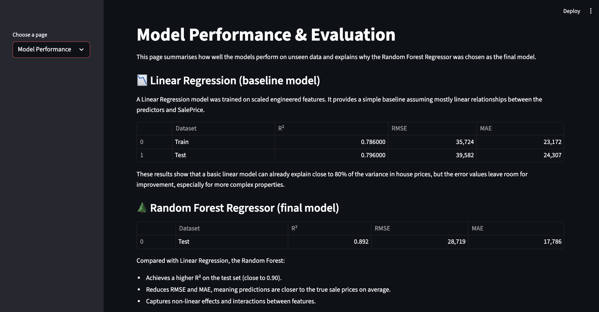
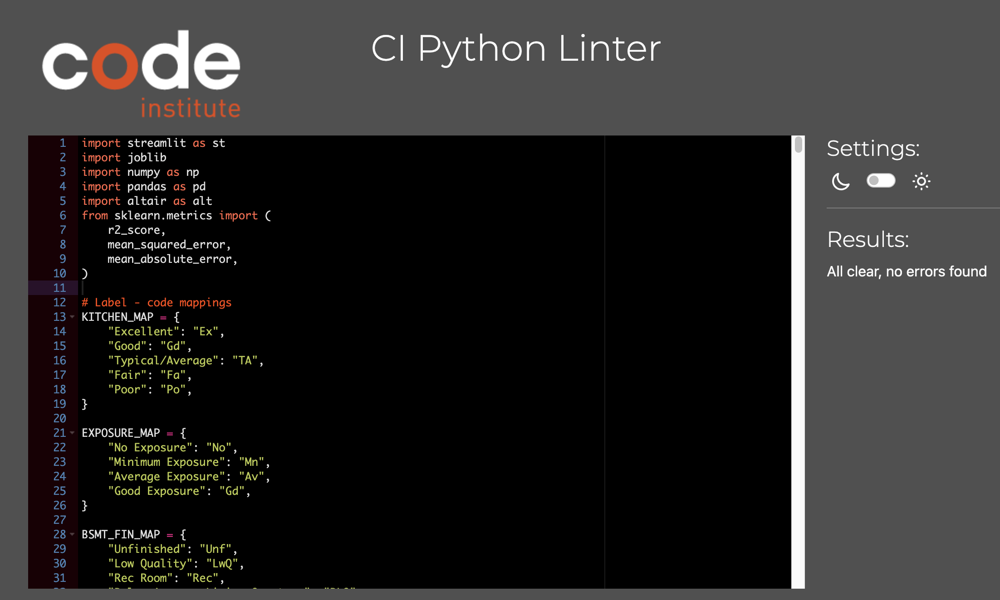

## Introduction

This project is the final requirement for the Code Institute Diploma in Full Stack Software Development (Predictive Analytics).  
Its purpose is to support a client who wants to understand what makes a house valuable and to predict the sale prices of four homes they have inherited in Ames, Iowa.

The project uses the Ames Housing dataset from [Kaggle](https://www.kaggle.com/codeinstitute/housing-prices-data) and applies data cleaning, exploratory data analysis (EDA), feature engineering, and machine learning (ML) to build an accurate house price prediction model.  
The results are presented in an interactive Streamlit dashboard that allows the client to:

- explore key factors that influence house prices,
- view model performance,
- see predicted prices for their inherited properties, and
- generate real-time predictions for any house configuration.

A link to the deployed dashboard...

## Business Requirements

The client, Lydia Doe, recently inherited four residential properties in Ames, Iowa, from her great-grandfather.  
Although Lydia is familiar with property valuation in her home country of Belgium, she is unsure whether the same factors that influence property prices there also apply to the Iowan housing market. Because inaccurate pricing could lead to financial loss, she has asked for data-driven support.

Lydia located a publicly available dataset containing historical house prices for Ames, Iowa, and has provided this data for analysis. She requires a solution that can help her:

1. **Understand which house attributes are most strongly correlated with SalePrice.**  
   Lydia wants to identify what makes a house desirable and valuable in the Ames market.  
   She expects clear **data visualisations** demonstrating how key variables relate to the sale price, so she can understand which features contribute most to valuation.

2. **Predict the sale price of her four inherited houses, as well as any other house in Ames, Iowa.**  
   Lydia needs accurate price estimates for her inherited properties in order to maximise their sale value.  
   Additionally, she wants the ability to generate predictions for any future property she might consider buying or selling in Ames.

To meet these requirements, a ML regression model is developed and integrated into an interactive Streamlit dashboard that presents the insights and predictions in an accessible, user-friendly format.

## Dataset Content

This project uses the **Ames Housing Dataset**, originally compiled by Dean De Cock and made publicly available on [Kaggle](https://www.kaggle.com/codeinstitute/housing-prices-data).  
The dataset contains detailed structural, qualitative, and locational attributes for residential properties in Ames, Iowa, and is commonly used for house price prediction tasks.

### Dataset Overview

- **Rows:** ~1,460 observations  
- **Columns:** 79 variables  
- **Time span:** Houses built between **1872 and 2010**  
- **Target variable:** `SalePrice` (the final sale price of the property)

Each row represents a single house and describes features such as lot size, living area, basement finish type, kitchen quality, number of rooms, and garage characteristics.

### Key Variables Used in This Project

Although the full dataset contains 79 variables, this project focuses on the variables most relevant to the client’s business requirements.  
Below is a summary of the main features used in the modelling and dashboard analysis:

| Variable | Description | Typical Range / Categories |
|---------|-------------|---------------------------|
| **1stFlrSF** | First floor living area (sq ft) | 334 – 4692 |
| **2ndFlrSF** | Second floor living area (sq ft) | 0 – 2065 |
| **BedroomAbvGr** | Bedrooms above ground | 0 – 8 |
| **BsmtExposure** | Basement exposure / walkout type | Gd, Av, Mn, No |
| **BsmtFinType1** | Basement finish quality/type | GLQ, ALQ, BLQ, Rec, LwQ, Unf |
| **BsmtFinSF1** | Finished basement area (sq ft) | 0 – 5644 |
| **BsmtUnfSF** | Unfinished basement area (sq ft) | 0 – 2336 |
| **TotalBsmtSF** | Total basement area (sq ft) | 0 – 6110 |
| **GarageArea** | Garage size (sq ft) | 0 – 1418 |
| **GarageFinish** | Interior finish of garage | Fin, RFn, Unf |
| **GrLivArea** | Above-ground living area (sq ft) | 334 – 5642 |
| **KitchenQual** | Kitchen quality | Ex, Gd, TA, Fa, Po |
| **LotArea** | Lot size (sq ft) | 1,300 – 215,245 |
| **LotFrontage** | Street-facing linear feet | 21 – 313 |
| **MasVnrArea** | Masonry veneer area (sq ft) | 0 – 1600 |
| **EnclosedPorch** | Enclosed porch area (sq ft) | 0 – 286 |
| **OpenPorchSF** | Open porch area (sq ft) | 0 – 547 |
| **OverallCond** | Overall condition of house (1–10) | 1 – 10 |
| **OverallQual** | Overall material/finish quality (1–10) | 1 – 10 |
| **WoodDeckSF** | Wood deck area (sq ft) | 0 – 736 |
| **YearBuilt** | Original construction year | 1872 – 2010 |
| **YearRemodAdd** | Year remodeled (or year built if unchanged) | 1950 – 2010 |
| **SalePrice** | Final sale price (USD) | $34,900 – $755,000 |

### Why This Dataset Was Chosen

The Ames Housing dataset is suitable for this project because:

- It directly reflects the **Iowa property market**, aligning with the client’s needs.
- It contains enough historical data to train a reliable predictive model.
- It includes the types of variables the client is curious about (quality, size, basement, garage, living area).
- It is already publicly available and ethically safe to use.

### Variables Used for Modelling

After data cleaning and feature engineering, the following **10 engineered features** were used in the final Random Forest model:

- `GarageArea`  
- `OverallQual`  
- `OverallCond`  
- `KitchenQual` (ordinal encoded)  
- `BsmtExposure` (ordinal encoded)  
- `BsmtFinType1` (ordinal encoded)  
- `GarageFinish` (ordinal encoded)  
- `GrLivArea_log` (log-transformed)  
- `TotalBsmtSF_log` (log-transformed)  
- `LotArea_log` (log-transformed)

These features were selected based on correlation analysis, predictive power, and alignment with the client’s business questions.

## Hypothesis

The following hypothese were developed after inspecting and exploring the Ames Housing dataset (EDA) but before cleaning or modelling: 

* **Larger homes sell for higher prices.** - Homes with greater living area (`GrLivArea`, `1stFlrSF`, `TotalBsmtSF`) and larger overall footprint should achieve higher sale prices

* **Higher construction quality increases sale price.** - `OverallQual` (materials and finish quality) is expected to be one of the strongest predictors of price.

* **Homes with larger garages sell for higher prices.** - Homes with bigger `GarageArea` and `GarageCars` are expected to sell for more.

* **Newer or recently renovated homes are worth more.** - `YearBuilt` and `YearRemodAdd` should be positively associated with price as newer homes often require less maintenance.

* **Smaller features have limited influence** - Variables such as `BedroomAbvGr`, `EnclosedPorch` and `OverallCond` were expected to have weak correlations with price.

### How the Hypotheses will be validated:

Each hypothesis will be validated using a combination of exploratory data analysis (EDA), visualisations, and machine learning (ML) modelling.

1. **Correlation Analysis**
Pearson correlation coefficients and the correlation heatmap are used to test if key features (e.g., `GrLivArea`, `OverallQual`, `TotalBsmtSF`, `GarageArea`) show strong relationships with `SalePrice`.
This directly validates hypotheses about size, quality, and age.

2. **Visual Explorations**
Scatterplots, boxplots, and distribution plots will be used to visually confirm the strength of the relationships between important predictors and the sale price.
This helps validate whether trends expected in the hypotheses appear in the data.

3. **Feature Importance from the ML Model**
Once the regression model is trained, its feature importance values (e.g., coefficients for Linear Regression or feature importances from Random Forest) will indicate which features the model relies on most.
This validates whether the predicted “top features” are indeed useful in predicting sale price.

4. **Model Performance (R² Score)**
A model achieving R² ≥ 0.75 on both training and test data suggests that the chosen features and hypotheses align with real market behaviour.
If removing weak features improves the score, the hypotheses about feature relevance are further validated.

All these steps ensures conclusions are backed by both EDA insights and predictive modelling performance.

## The rationale to map the business requirements to the Data Visualisations and ML tasks

**Business Requirement 1** - Understand how house attributes correlate with `SalePrice`

To answer this requirement, the project uses conventional EDA techniques:
    - Correlation analysis to identify the strongest relationships between features and `SalePrice`.
    - Heatmaps to provide a visual overview of feature interactions.
    - Scatterplots & boxplots to show clear trends and validate assumptions.
    - Summary statistics & distributions to detect skewness, outliers, and variable behavior.

These visualisations help the client understand which attributes influence a property's value the most and satisfies their first requirement by showing the most relevant variables correlated to `SalePrice`.

**Business Requirement 2** - Predict the sale prices of the 4 inherited houses (and any other house in Ames)

To answer this requirement, the project implements a ML regression model:
    - Data cleaning and preprocessing ensure the model receives complete, reliable inputs.
    - Feature selection is guided by the EDA results from requirement 1.
    - Regression modelling (Linear Regression and Random Forest) is used to map feature relationships to `SalePrice`.
    - Model evaluation ensures performance meets the agreed metric of **R² ≥ 0.75** on both train and test sets.
    - Model inference allows prediction of `SalePrice` for the inherited houses and other inputs.

This satisfies the client’s second requirement to accurately predict house prices based on their attributes.

**Dashboard Deliverable** - Provide insights and predictions through an interactive dashboard

The project includes a Streamlit dashboard that allows the client to:
    - View EDA visualisations 
    - Explore relationships between features and `SalePrice`
    - Enter custom house features and generate predictions 
    - View predicted sale prices for all four inherited houses
    - Navigate results in a user-friendly interface

This ensures the project outcome is intuitive, transparent, and actionable for the client.

## CRISP-DM

The above business requirements map directly onto the CRISP-DM workflow:

| **CRISP-DM Phase**        | **How It Maps to the Project**                                   |
|---------------------------|------------------------------------------------------------------|
| Business Understanding    |     Identify client   goals: correlations + predictions          |
|     Data Understanding    |     EDA, correlation   analysis, visualisations                  |
|     Data Preparation      |     Cleaning, handling   missing values, encoding                |
|     Modelling             |     Regression model   training + optimisation                   |
|     Evaluation            |     R² ≥ 0.75   performance requirement                          |
|     Deployment            |     Streamlit   dashboard delivering insights and predictions    |

## ML Business Case

The objective of this project is to build a supervised machine learning system that predicts house sale prices in Ames, Iowa. The client will use this system to determine the combined value of 4 inherited properties and to evaluate any future properties.

#### Type of ML Task:

This is a supervised regression task because the **target variable `SalePrice`** is continuous and the model learns patterns from labelled historical data. 

#### Variables

**Dependent variable (Target):** 

- The variable we aim to predict is `SalePrice` of a house in USD. 
- This is the value the model outputs 

**Independent Variables (Features):**

- These are the inputs the model uses to learn and make predictions which are based on EDA findings and correlation analysis, the following features will be used:
   * Size-related features: `GrLivArea`, `1stFlrSF`, `2ndFlrSF`, `TotalBsmtSF` and `LotArea`.
   * Quality and condition features: `OverallQual` and `OverallCond`
   * Garage features: `GarageArea` and `GarageYrBlt`
   * Age features: `YearBuilt` and `YearRemodAdd`
   * Exterior/amenity features: `MasVnrArea`, `WoodDeckSF`, `OpenPorchSF` and `EnclosedPorch`.
   * Basement features: `BsmtFinSF1` and `BsmtUnfSF`
   * Other numerical features included after cleaning and feature selection.

These features provide the information the model needs to understand how house characteristics influence sale price.

**Output**

A single numerical value = the predicted house sale price 

## Business Value 

Building this regression model benefits the client by enabling:

- Accurate sale price estimates for the four inherited houses
- Evidence-based Understanding of which features influence property value the most
- Better decision-making when selling or investing in properties
- A tool to assess the value of any additional property through the dashboard

This ensures the client has a reliable, data-driven tool rather than relying on guesswork.

## Model Requirements

Because the client needs to estimate house sale prices in Ames, Iowa, this project requires a **supervised machine learning regression model**. The goal is to map a set of house attributes (features) to a continuous numerical output (SalePrice).

### Type of Model Needed
The dataset suggests a **regression approach**, as the target variable (`SalePrice`) is continuous.  
Conventional machine learning methods such as **Linear Regression** and **Random Forest Regression** are suitable and were explored in this project.

### Model Inputs
The model receives the engineered house attributes selected after feature analysis and cleaning.  
The final Random Forest model uses the following **10 features**:

- `GarageArea`
- `OverallQual`
- `OverallCond`
- `KitchenQual` (ordinal encoded)
- `BsmtExposure` (ordinal encoded)
- `BsmtFinType1` (ordinal encoded)
- `GarageFinish` (ordinal encoded)
- `GrLivArea_log` (log-transformed)
- `TotalBsmtSF_log` (log-transformed)
- `LotArea_log` (log-transformed)

These features were chosen because they demonstrated strong predictive value in the EDA and feature importance study.

### Model Output
The model predicts:

- **The sale price (in USD) of a given house**, based on its features.

This includes:
- The **four inherited houses** the client owns.
- **Any new house** the client wishes to evaluate through the Streamlit dashboard.

### Performance Criteria
During the Business Case Assessment, the following performance requirement was agreed with the client:

- The model should achieve an **R² score of at least 0.75** on both the training and test datasets.

This ensures that the model captures enough variability in the housing market to produce reliable price estimates.

### Models Evaluated
Two models were trained and compared:

1. **Linear Regression (scaled features)**  
   - Train R² ≈ 0.786  
   - Test R² ≈ 0.796  

2. **Random Forest Regressor (unscaled features)**  
   - Train R² ≈ 0.974  
   - Test R² ≈ 0.892  

Both models met the minimum performance requirement, but the Random Forest model achieved:

- Higher R²  
- Lower error (RMSE and MAE)  
- Better ability to capture non-linear relationships  

Therefore, **Random Forest** was selected as the final model.

### Why This Model Meets the Client’s Needs
The final model:

- Reliably predicts house sale prices with strong accuracy.
- Meets and exceeds the agreed R² performance threshold.
- Can estimate the sale price of the four inherited houses.
- Can be used interactively via the dashboard to predict future property values.
- Identifies the features most strongly associated with `SalePrice`, helping the client understand what drives value in the Ames housing market.

### The client defined success as:
    - R² score ≥ 0.75 on both the training and test sets
    - Accurate predictions for all 4 inherited houses
    - Confidence that the model generalises to unseen data
    - A deployed dashboard the client can use independently

### The model is considered unsuccessful if:
    - R² < 0.75
    - Predictions are unstable
    - The model is wrong by more than ~30% over a longer period
    - Insights do not match real market trends

## Dashboard Design

This section outlines the final Streamlit dashboard created for the client.
Each page is supported by a screenshot and a short explanation describing what the client sees and how it meets the business requirements.

**Page 1 – Project Summary**

This page provides a high-level overview of the project. It includes:

* The Project Title (“House Price Predictor”)
* A description of the Ames Housing Dataset
* The client’s business requirements
* A link to the full project README
* Dataset guidelines (encodings, transformations, missing values)

This page ensures the client understands the purpose, data source, and scope before they continue exploring the dashboard.

**Page 2 – House Sales Price Study (Feature Insights)**

This page addresses **Business Requirement 1: identifying which housing features have the strongest relationship with SalePrice**.

It includes:

* A summary of the client’s expectations
* A button allowing the client to inspect a small preview of the training dataset
* A Random Forest Feature Importance bar chart
* A list of the three most influential features:

  * OverallQual
  * GrLivArea_log
  * TotalBsmtSF_log

This page helps the client understand which features they should prioritise when renovating, valuing, or analysing houses in Ames, Iowa.

**Page 3 – Inherited Houses & Price Prediction**

This page addresses **Business Requirement 2: predicting the sale price of the four inherited houses and any other property in Ames**.

The page features:

* A hero image showing an Ames neighbourhood
* Sidebar input widgets for house attributes (e.g., floor area, basement size, quality ratings)
* A preview table of the four inherited houses
* Model-generated predicted prices for each property
* A total estimated combined value of all four inherited homes

This page allows the client to test new configurations and forecast sale prices in real time.

**Page 4 – Project Hypotheses & Validation**

This page includes:

* A list of initial hypotheses created during early EDA
* A detailed explanation of how each hypothesis was tested
* Tools used for validation (correlations, scatterplots, feature importance, model performance)
* Evidence showing which hypotheses were confirmed and which were weakly supported

This page demonstrates clear reasoning and transparent analysis for the client and assessor.

**Page 5 – Model Performance & Evaluation**

This page presents how well the machine learning models performed on unseen data. It includes:

**Linear Regression (baseline model)**

* Train R² ≈ 0.78
* Test R² ≈ 0.80
* RMSE and MAE values

**Random Forest (final model)**

* Test R² ≈ 0.89
* Lower RMSE and MAE

The page also includes a scatter plot comparing **Actual vs Predicted SalePrice**, which visually confirms the model’s accuracy.

This section clearly demonstrates that the final model met and exceeded the client’s performance requirement of achieving an R² ≥ 0.75.

## Testing

This section describes how the Heritage Housing Price Prediction project was tested, both in terms of the machine learning models and the Streamlit data web app.

### Testing Strategy

Testing was carried out using:

- Manual testing of the data preparation and modelling notebooks.
- Manual, scenario-based testing of the Streamlit dashboard.
- Visual inspection of plots and feature importance to verify that the results were sensible.
- Automatic tesing of the `app.py` file for PEP8 compliance using the Code Institute Python Linter. 

The app was run locally using `streamlit run app.py` and tested in a modern desktop browser.

---

### 1. Code Validation (PEP8 Compliance)

The `app.py` file was tested for PEP8 compliance using the Code Institute Python Linter.  
The code was copied into the CI Linter tool, and the results returned:

**“All clear, no errors found.”**

This confirms that the dashboard code meets standard Python style guidelines and does not contain any syntax or formatting issues that violate PEP8 conventions.

### 2. Data and Modelling Tests

#### 2.1 Data integrity

| Test | Description | Result |
|------|-------------|--------|
| Missing values in model features | Confirm that the engineered training and test sets (`train_engineered.csv`, `test_engineered.csv`) contain no `NaN` values in the final model feature set. | ✅ All model features were confirmed to have no missing values after imputation and encoding. |
| Data types | Check that numerical features (areas, quality scores, years) are stored as numeric types and that encoded categoricals are integers. | ✅ All model input columns have appropriate numeric dtypes. |
| Log-transformed features | Verify that `GrLivArea_log`, `TotalBsmtSF_log` and `LotArea_log` were correctly created using `np.log1p`. | ✅ Values match manual checks on sample rows. |

#### 2.2 Model performance checks

The following results were obtained in the modelling notebook and confirmed in the Streamlit app.

**Linear Regression (scaled features)**  
- Train R²: **0.786**  
- Test R²: **0.796**  
- Test RMSE: **39,582**  
- Test MAE: **24,307**

**Random Forest Regressor (unscaled features)**  
- Train R²: **0.974**  
- Test R²: **0.892**  
- Test RMSE: **28,719**  
- Test MAE: **17,786**

These values were used to check that:

- The Random Forest model improves on Linear Regression, especially in terms of MAE.
- There is no extreme overfitting (Train R² is higher, but Test R² remains strong at ~0.89).

---

### 3. Streamlit Dashboard – Manual Testing

The Streamlit dashboard was tested by navigating through each page and checking that widgets, plots and calculations behaved as expected.

#### 3.1 Navigation and layout

| Test ID | Scenario | Expected Result | Actual Result |
|--------|----------|-----------------|---------------|
| NAV-01 | Start the app with `streamlit run app.py`. | App launches without errors and default page loads. | ✅ Pass |
| NAV-02 | Use the sidebar dropdown to switch between all five pages. | Each of the following pages loads correctly: Project Summary, Feature Insights, Inherited Houses & Price Prediction, Hypotheses, Model Performance. | ✅ Pass |
| NAV-03 | Resize the browser window. | Layout remains readable on smaller widths; no widgets overlap or disappear. | ✅ Pass |

#### 3.2 Project Summary page

| Test ID | Scenario | Expected Result | Actual Result |
|--------|----------|-----------------|---------------|
| SUM-01 | Open the **Project Summary** page. | Title, dataset description and business requirements are displayed. | ✅ Pass |
| SUM-02 | Click the README link button. | GitHub README opens in a new browser tab. | ✅ Pass |

#### 3.3 Feature Insights page

| Test ID | Scenario | Expected Result | Actual Result |
|--------|----------|-----------------|---------------|
| FEAT-01 | Open **Feature Insights** page. | Client expectations text and explanation are shown. | ✅ Pass |
| FEAT-02 | Expand the “Inspect a sample of the training data” expander. | A table with sample rows from the training data is displayed. | ✅ Pass |
| FEAT-03 | Check feature importance chart. | Bar chart appears with all 10 model features ordered by importance. | ✅ Pass |
| FEAT-04 | View feature vs sale price plots. | Scatter plots and bar chart render correctly and respond to hover tooltips. | ✅ Pass |

#### 3.4 Inherited Houses & Price Prediction page

| Test ID | Scenario | Expected Result | Actual Result |
|--------|----------|-----------------|---------------|
| INH-01 | Open **Inherited Houses & Price Prediction** page. | Hero image, title, and description of the two page parts are visible. | ✅ Pass |
| INH-02 | Check inherited houses table. | Table shows 4 rows (one per inherited house) with their attributes and `PredictedSalePrice`. | ✅ Pass |
| INH-03 | Verify per-house prices. | Under “Predicted Sale Price per House”, four bullet points are shown, one for each house, with correctly formatted prices. | ✅ Pass |
| INH-04 | Verify total value. | “Total estimated value for all 4 inherited houses” equals the sum of the four predicted prices. | ✅ Pass |
| INH-05 | Adjust sidebar inputs and click **Predict Price**. | A new predicted price is displayed in a green success box; no errors occur. | ✅ Pass |
| INH-06 | Try extreme but valid values (e.g. very large living area). | Prediction is still generated and app remains responsive. | ✅ Pass |

#### 3.5 Hypotheses page

| Test ID | Scenario | Expected Result | Actual Result |
|--------|----------|-----------------|---------------|
| HYP-01 | Open **Hypotheses** page. | All hypotheses are listed with clear explanations. | ✅ Pass |
| HYP-02 | Scroll down to results section. | Section summarising which hypotheses are supported / partially supported is visible and consistent with model results. | ✅ Pass |
| HYP-03 | Check feature importance table on this page. | Top 5 features and their importance values are displayed without error. | ✅ Pass |

#### 3.6 Model Performance page

| Test ID | Scenario | Expected Result | Actual Result |
|--------|----------|-----------------|---------------|
| PERF-01 | Open **Model Performance** page. | Intro text and Linear Regression metrics table are displayed. | ✅ Pass |
| PERF-02 | Verify Random Forest metrics. | Test R², RMSE and MAE values are computed and shown; values are consistent with the modelling notebook. | ✅ Pass |
| PERF-03 | Check Actual vs Predicted plot. | Scatter plot appears; points cluster around the diagonal; tooltips show actual and predicted prices. | ✅ Pass |

---

### 4. Known Issues and Limitations

- The app does not currently include formal validation for unrealistic user inputs (for example, extremely large numbers that are outside the range of the original training data). Sliders and minimum/maximum values partially mitigate this.
- No automated unit tests have been implemented; all testing is manual.

Despite these limitations, the Streamlit dashboard behaves reliably in normal use, and the models provide stable and consistent predictions for houses within the range of the Ames dataset.

## Unfixed Bugs

**No bugs found**

## Deployment

### Heroku

* The App live link is: <https://YOUR_APP_NAME.herokuapp.com/>
* Set the .python-version Python version to a [Heroku-24](https://devcenter.heroku.com/articles/python-support#supported-runtimes) stack currently supported version.
* The project was deployed to Heroku using the following steps.

1. Log in to Heroku and create an App
2. At the Deploy tab, select GitHub as the deployment method.
3. Select your repository name and click Search. Once it is found, click Connect.
4. Select the branch you want to deploy, then click Deploy Branch.
5. The deployment process should happen smoothly if all deployment files are fully functional. Click the button Open App on the top of the page to access your App.
6. If the slug size is too large then add large files not required for the app to the .slugignore file.

## Credits

This section acknowledges all external sources, tutorials, templates, and media used throughout the development of this project. Proper credit is given to maintain transparency and avoid plagiarism.

### Content

- The initial project structure was built using the Code Institute template for this milestone project:  
[Heritage Housing Issues Template](https://github.com/Code-Institute-Solutions/milestone-project-heritage-housing-issues.git)

- The project workflow, data-cleaning steps, modelling stages, and dashboard structure were guided by the Code Institute Predictive Analytics curriculum.

- Several explanations, debugging support, code refinements, and documentation phrasing were supported by [ChatGPT](https://chat.openai.com/), used as a learning and productivity tool throughout the project.

- Additional guidance on feature engineering was taken from:  
[DataCamp — Feature Engineering in Python](ttps://www.datacamp.com/tutorial/feature-engineering)

- General Python, pandas, and scikit-learn development was supported by: 
  - [W3schools](https://www.w3schools.com/)
  - [Official scikit-learn documentation](https://scikit-learn.org/stable/user_guide.html)
  - [Streamlit documentation](https://docs.streamlit.io/)

### Media

- **Hero Image (Inherited Houses Page)**  
  Sourced from:  
  https://adampretorius.com/neighborhoods/peninsula-neighborhood  

- **Sidebar Image (Inherited Houses Page)**  
  Sourced from Clifton Gray Real Estate:  
  https://www.cliftongray.co.uk/wp-content/uploads/depositphotos_9433517-stock-photo-house-for-sale-real-estate.webp

### Tools & Libraries

This project used the following tools and libraries:

- **Python 3.11**
- **pandas**, **numpy**
- **scikit-learn**
- **Streamlit**
- **Altair**  
- **joblib**
- **Jupyter Notebook**
- **GitHub** for version control and project hosting

### Acknowledgements

- Code Institute course materials for guidance on data analysis, feature engineering, modelling, and dashboard development.
- ChatGPT for assistance with concept explanations, debugging issues, code refinement, and generating documentation text included in this README.

